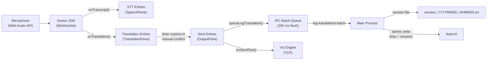
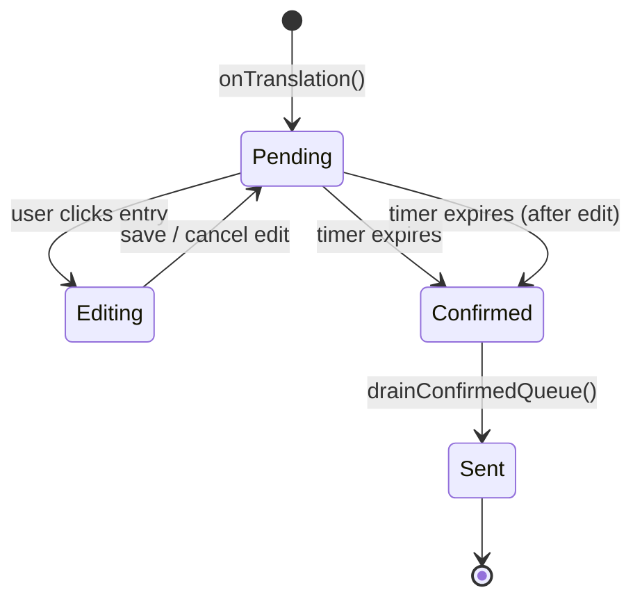

# Architecture Overview

ExpressText is an Electron desktop application that provides real-time speech-to-text transcription (Urdu) and one-way translation (Urdu to English) using the Soniox SDK. Translated entries pass through a timed edit window before being written to an output feed file consumed by downstream systems.

## High-Level Process Model

```
┌─────────────────────────────────────────────────────────┐
│                    Main Process                         │
│  index.ts  ipc.ts  config.ts  session.ts  store.ts      │
│  window.ts  metrics.ts  logger.ts  updater.ts           │
│  viz-engine.ts                                          │
├─────────────────────────────────────────────────────────┤
│                 Preload (contextBridge)                 │
│  preload/index.ts — exposes electronAPI on window       │
├─────────────────────────────────────────────────────────┤
│                  Renderer Process                       │
│  SolidJS SPA — App.tsx, components, lib hooks           │
│  Soniox SDK (WebSocket) ── runs in renderer             │
└─────────────────────────────────────────────────────────┘
```

The main process owns configuration persistence, session file I/O, feed file writes, API key encryption, microphone permission brokering, performance metrics collection, auto-updates, and the Viz Engine TCP connection. The renderer process owns the Soniox WebSocket connection, audio capture, UI rendering, and the entry lifecycle state machine.

## Process Communication

All IPC flows through `contextBridge.exposeInMainWorld("electronAPI", ...)` in the preload script. The renderer never accesses Node APIs directly.

**Renderer -> Main (invoke/handle):**

| Channel                              | Purpose                                           |
| ------------------------------------ | ------------------------------------------------- |
| `get-api-key`                      | Retrieve decrypted Soniox API key                 |
| `save-api-key`                     | Encrypt and persist a new API key                 |
| `has-api-key`                      | Check whether a key exists                        |
| `get-config` / `save-config`     | Read/write app configuration                      |
| `get-models`                       | List Soniox models available in Settings          |
| `start-session` / `stop-session` | Open/close session log file and feed path         |
| `log-translation`                  | Write a single translation line to session + feed |
| `log-translations-batch`           | Write multiple translation lines (batched)        |
| `ensure-mic-access`                | Request/check microphone permission (OS-level)    |
| `perf:start` / `perf:stop`       | Start/stop metrics collection interval            |
| `perf:ping`                        | Measure IPC round-trip time                       |
| `clipboard:write`                  | Write text to system clipboard                    |
| `viz:load-scene`                   | Load the configured Viz Engine scene              |
| `viz:continue`                     | Send IN/OUT (continue) command to Viz Engine      |
| `viz:send-text`                    | Push a translation line to a Viz Engine text slot  |
| `viz:toggle-scroll`                | Start or stop Viz Engine scroll animation         |
| `viz:set-speed`                    | Set Viz Engine scroll speed                       |
| `viz:hard-reset`                   | Stop scroll and clear all Viz Engine text slots   |
| `viz:get-status`                   | Get current Viz Engine controller state           |

**Main -> Renderer (webContents.send):**

| Channel           | Purpose                                       |
| ----------------- | --------------------------------------------- |
| `perf:snapshot` | Periodic performance metrics (every 2 s)      |
| `open-settings` | Menu item triggers settings modal in renderer |
| `update-status` | Auto-updater status (downloading, ready, up-to-date, error) |
| `viz:status`    | Periodic Viz Engine state snapshot            |

## Data Flow



1. The renderer captures microphone audio via `MicrophoneSource` (Soniox SDK wrapper around `getUserMedia`).
2. Audio streams over a WebSocket to Soniox servers. Results arrive as `RealtimeResult` objects containing tokens.
3. Tokens are parsed into original text (Urdu) and translated text (English). Original text is pushed to `sttEntries`; translations are pushed to `transEntries`.
4. Each translation entry starts a countdown timer (`reviewTimeMs`). When the timer fires (or the user manually confirms), the entry transitions to `confirmed` then `sent`.
5. Sent entries are batched in a renderer-side queue (`logQueue`) that flushes every 200 ms via the `log-translations-batch` IPC channel. Concurrently, each sent entry is pushed to the Viz Engine via `vizSendText()`.
6. The main process writes each line to the session log (append-only `WriteStream`) and buffers the latest line for the feed file.
7. The feed file is atomically updated (write to `.tmp`, then rename) every 200 ms, always containing the most recent translation line.
8. The Viz Engine controller (`viz-engine.ts`) sends text to a Vizrt graphics engine over TCP, managing scene loading, text slot assignment, and scroll animation.

## Entry Lifecycle



| Status              | Behavior                                                                                                                                                  |
| ------------------- | --------------------------------------------------------------------------------------------------------------------------------------------------------- |
| **Pending**   | Entry is visible with a countdown. User can click to edit. Timer runs for `review_time_seconds`.                                                         |
| **Editing**   | Timers for the edited entry and all entries after it are paused; earlier entries keep counting down and auto-confirming normally. Auto-scroll is paused. An inline text input replaces the entry text. Enter saves, Escape cancels. Focus-out auto-saves. Only one entry can be edited at a time. On save/cancel, paused countdowns resume from where they left off; entries that arrived during the pause start with a full countdown. |
| **Confirmed** | Timer expired or edit was saved. Entry awaits sequential drain.                                                                                           |
| **Sent**      | Entry has been written to the IPC batch queue and appears in the OutputPane.                                                                              |

The `drainConfirmedQueue()` function processes confirmed entries sequentially from a write-index pointer, ensuring entries are sent to the feed in arrival order even if earlier entries are still being edited.

Entries are capped at `MAX_ENTRIES = 500` per list. When overflow occurs, the oldest entry is removed and the write index is adjusted.

## State Management

The app uses SolidJS fine-grained reactivity throughout:

- **`createSignal`** for all UI state (running, config, status, split ratios, uptime, etc.)
- **`createMemo`** for derived values (badge class, entry counts, virtual list ranges)
- **`createEffect`** for side effects (auto-scroll, countdown timers, audio level tracking)
- **`batch`** to coalesce multiple signal updates into a single render pass

Key reactive hooks:

| Hook                   | Location                   | Purpose                                                                              |
| ---------------------- | -------------------------- | ------------------------------------------------------------------------------------ |
| `createEntryManager` | `lib/entry-manager.ts`   | Manages STT, translation, and sent entry arrays plus the edit/confirm/send lifecycle |
| `createPerfMonitor`  | `lib/perf.ts`            | FPS counter, IPC RTT measurement, main/renderer CPU/memory tracking                  |
| `useAutoScroll`      | `lib/use-auto-scroll.ts` | Auto-scroll pinning for pane lists (stays pinned to bottom unless user scrolls up)   |

State does not use a global store. Each concern is encapsulated in a hook and composed in `App.tsx`.

## Security Model

| Measure                    | Implementation                                                                                             |
| -------------------------- | ---------------------------------------------------------------------------------------------------------- |
| `contextIsolation: true` | Renderer has no access to Node.js globals                                                                  |
| `nodeIntegration: false` | No `require()` in renderer                                                                               |
| `webSecurity: true`      | Standard CORS enforcement                                                                                  |
| `sandbox: false`         | Disabled because the app requires direct preload access (documented project constraint)                    |
| Preload bridge             | Only whitelisted functions exposed via `contextBridge.exposeInMainWorld`                                 |
| `safeStorage`            | API key encrypted via OS keychain (macOS Keychain / Windows DPAPI) before persisting in `electron-store` |
| Navigation blocked         | `will-navigate` prevented; external links open in system browser                                         |
| DevTools disabled in prod  | F12 and Cmd+Shift+I intercepted via `before-input-event`                                                 |
| Permission handler         | Only `media` permission requests are allowed                                                             |
| Input validation           | IPC handlers validate types and enforce length limits on timestamps (20 chars) and text (10,000 chars)     |
| Feed file path safety      | `basename()` strips directory traversal from config-provided file/dir names                              |
| Single instance lock       | `app.requestSingleInstanceLock()` prevents multiple app instances                                        |

## Performance Optimizations

### Auto-Scroll

All panes (Speech, Translation, VizPane history) use `useAutoScroll` to keep the list pinned to the bottom as new entries arrive. When the user scrolls up (more than 80 px from the bottom), auto-scroll is suspended until they scroll back down. The TranslationPane also passes an editing flag that pauses auto-scroll while any entry is being edited, preventing the scroll position from jumping while the user is typing.

### Batched IPC

Translation log writes are batched in a renderer-side queue (`logQueue`) and flushed every 200 ms via a single `log-translations-batch` call, avoiding per-entry IPC overhead.

### Code Splitting

`SettingsModal` and `PerfOverlay` are lazy-loaded with SolidJS `lazy()` so they are not in the critical render path. Both are wrapped in `ErrorBoundary` to prevent rendering failures from crashing the app.

### Deferred Menu

The application menu is built inside `setImmediate()` after window creation, so menu construction (which reads `package.json`) does not block the initial window paint.

### Double-Buffer Audio

The `audio-level.ts` module uses two pre-allocated arrays (`outputBufA` / `outputBufB`) that swap each frame, avoiding per-frame array allocation for the waveform visualizer.

### Build Optimizations

- Manual chunks split `@soniox/client` and `solid-js` into separate cached bundles
- `assetsInlineLimit: 0` prevents fonts from being inlined as data URIs
- `v8CacheOptions: "code"` enables V8 code caching for faster renderer startup
- `backgroundThrottling: false` prevents Chromium from throttling the renderer when the window loses focus

### Feed File Atomicity

The feed file is written atomically (write to `feed.txt.tmp`, then `rename`) to prevent readers from seeing partial content. Feed writes are also buffered and flushed every 200 ms.

## Auto-Reconnection Logic

Reconnection is delegated to the Soniox SDK via the `auto_reconnect` recording option — there is no in-app retry loop. When `startTranscription` constructs the recording, it passes:

- `auto_reconnect: true`
- `max_reconnect_attempts: MAX_RECONNECT_ATTEMPTS` (5)
- `reconnect_base_delay_ms: SONIOX_BASE_DELAY_MS` (1000)

The SDK handles transient WebSocket failures internally with exponential backoff and surfaces lifecycle events the app subscribes to:

1. While retries are in flight, the recording emits `reconnecting` — the app forwards this to the UI as the `"reconnecting"` state.
2. On a successful reconnect, the recording resumes streaming and emits `started`; the session timer continues uninterrupted.
3. The `error` event only fires once retries are exhausted or for non-retriable errors (e.g. `AuthError`, `BadRequestError`, `QuotaError`). Auth/API-key errors immediately stop the session and open the Settings modal.
4. User-initiated stop (`stopTranscription`) cancels the recording via the SDK, which also cancels any pending reconnect attempts.
