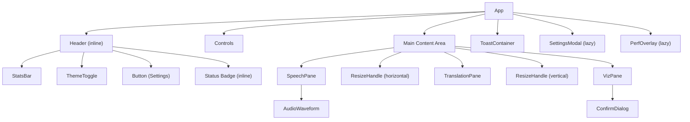

# Component Tree and Responsibilities

## Component Hierarchy

## App.tsx

The root component. Owns all top-level state and orchestrates the transcription session lifecycle.

**State managed:**
- `running` — whether a transcription session is active
- `showSettings` — controls SettingsModal visibility
- `config` — current `AppConfig` loaded from main process
- `activeMicId` — selected microphone device ID
- `status` / `statusText` — session state (`standby`, `loading`, `live`) and display label
- `uptime` — formatted HH:MM:SS elapsed time
- `hSplit` / `vSplit` — resizable panel split ratios (percentage)

**Hooks composed:**
- `createEntryManager(reviewTimeMs)` — manages all entry arrays and lifecycle
- `createPerfMonitor()` — toggleable performance monitoring

**Key behaviors:**
- On mount: loads config, checks for API key (opens settings if missing), sets theme from localStorage
- Listens for `open-settings` IPC event from main process menu
- Space bar toggles start/stop (when not in an input field)
- Ctrl/Cmd+Shift+P toggles the performance overlay
- On stop: flushes all pending entries, stops transcription, stops session

---

## Controls

**File:** `src/renderer/src/components/Controls.tsx`

**Props:**

| Prop | Type | Description |
|---|---|---|
| `running` | `Accessor<boolean>` | Whether a session is active |
| `onStart` | `(micDeviceId: string) => void` | Called with selected mic ID when Start is clicked |
| `onStop` | `() => void` | Called when Stop is clicked |
| `onClear` | `() => void` | Called when Clear is clicked |

**Behavior:**
- Enumerates audio input devices on mount and on `devicechange` events
- Renders a `<select>` dropdown for microphone selection (disabled while running)
- Start button disabled while running; Stop button uses danger variant while running
- Clear button always available

---

## SpeechPane

**File:** `src/renderer/src/components/SpeechPane.tsx`

**Props:**

| Prop | Type | Description |
|---|---|---|
| `entries` | `Accessor<TranscriptEntry[]>` | STT transcript entries |
| `finalCount` | `Accessor<number>` | Count of non-partial (final) entries |
| `live` | `Accessor<boolean>` | Whether session is active |
| `micDeviceId` | `Accessor<string>` | Current microphone device ID |

**Behavior:**
- Renders Urdu text right-to-left (`dir="rtl"`) using the eagerly-loaded Urdu font
- Uses `useAutoScroll` to stay pinned to the latest entry
- Shows `AudioWaveform` in the header when live
- Partial entries shown with "..." marker and dimmed text; final entries with a triangle marker
- Empty state shows animated waveform bars

---

## TranslationPane

**File:** `src/renderer/src/components/TranslationPane.tsx`

**Props:**

| Prop | Type | Description |
|---|---|---|
| `entries` | `Accessor<TranslationEntry[]>` | Translation entries with status |
| `live` | `Accessor<boolean>` | Whether session is active |
| `tickForEntry` | `(entryId: number) => number` | Returns the live tick for pre-edit entries and a frozen tick for paused (post-edit) entries |
| `reviewTimeMs` | `() => number` | Current review time in milliseconds |
| `onStartEdit` | `(id: number) => void` | Begin editing an entry |
| `onSaveEdit` | `(id: number, text: string) => void` | Save edited text |
| `onCancelEdit` | `(id: number) => void` | Cancel edit, restore original |
| `onEditChange` | `(id: number, text: string) => void` | Track in-progress edit text |

**Behavior:**
- Uses `useAutoScroll` to stay pinned to the latest entry; auto-scroll is paused while any entry is being edited
- Each entry rendered by `TranslationEntryRow` sub-component
- Color-coded left border per status: pending (amber), editing (blue), confirmed (green), sent (gray)
- Pending entries show a countdown timer and a progress bar animation
- Clicking a pending entry opens inline editing (input field with save/cancel buttons)
- New entries animate in with a typewriter effect (`type-reveal` CSS class)

---

## TranslationEntryRow

**File:** `src/renderer/src/components/TranslationPane.tsx` (internal component)

Renders a single translation entry row within the TranslationPane. Manages its own countdown interval for pending entries and handles inline editing via keyboard (Enter to save, Escape to cancel) or button clicks.

---

## VizPane

**File:** `src/renderer/src/components/VizPane.tsx`

**Props:** none (manages its own state via IPC)

**Behavior:**
- Viz Engine control panel replacing the former read-only OutputPane
- Polls `vizGetStatus` on mount and subscribes to `onVizStatus` push events for live state
- **Controls:** Load Scene, IN/OUT (continue), Scroll/Stop toggle (Ctrl+Space), speed slider (0.1–1.0), Hard Reset
- Connection status indicator (green dot = connected, gray = disconnected)
- Slot counter shows current text index out of 15 slots when scene is loaded
- History log with auto-scroll (`useAutoScroll`) displaying timestamped action/info entries
- Hard Reset protected by a `ConfirmDialog` prompt
- Empty state prompts user to load a scene

---

## ConfirmDialog

**File:** `src/renderer/src/components/ConfirmDialog.tsx`

**Props:**

| Prop | Type | Description |
|---|---|---|
| `open` | `boolean` | Whether the dialog is visible |
| `title` | `string` | Dialog heading |
| `message` | `string` | Explanatory body text |
| `confirmLabel` | `string` (optional) | Label for confirm button (default: `"Confirm"`) |
| `onConfirm` | `() => void` | Called when user confirms |
| `onCancel` | `() => void` | Called when user cancels or clicks backdrop |

**Behavior:**
- Modal overlay with backdrop blur
- Danger-styled confirm button, ghost cancel button
- Clicking backdrop triggers cancel
- Used by VizPane for the Hard Reset confirmation

---

## SettingsModal

**File:** `src/renderer/src/components/SettingsModal.tsx`

**Props:**

| Prop | Type | Description |
|---|---|---|
| `config` | `AppConfig \| null` | Current configuration |
| `onClose` | `() => void` | Close the modal |
| `onSaved` | `(config: AppConfig) => void` | Called with new config after save |

**Behavior:**
- Lazy-loaded via `solid-js/lazy`
- Three tabs: **Soniox**, **Output**, **Viz Engine**
- **Soniox tab:** model (text), endpoint detection (checkbox), API key (password, leave empty to keep current)
- **Output tab:** review time (numeric, seconds)
- **Viz Engine tab:** host (text), port (numeric, 1–65535), scene path (text), default scroll speed (0.1–1.0), auto-pause on idle (checkbox + seconds), auto-pause on edit (checkbox)
- Validates model non-empty, review time non-negative, port valid, scroll speed in range before saving
- Enter saves, Escape closes; clicking backdrop closes
- Saves API key and config via separate IPC calls

---

## PerfOverlay

**File:** `src/renderer/src/components/PerfOverlay.tsx`

**Props:**

| Prop | Type | Description |
|---|---|---|
| `fps` | `Accessor<number>` | Renderer frames per second |
| `ipcRtt` | `Accessor<number>` | IPC round-trip time (ms) |
| `mainCpu` | `Accessor<number>` | Main process CPU % |
| `rendererCpu` | `Accessor<number>` | Renderer process CPU % |
| `mainMemory` | `Accessor<{ rss, heapUsed, heapTotal }>` | Main process memory |
| `rendererMemory` | `Accessor<number>` | Renderer working set (bytes) |
| `eventLoopLag` | `Accessor<number>` | Main process event loop lag (ms) |
| `latency` | `Accessor<string>` | Transcription latency display |
| `words` | `Accessor<number>` | Word count |
| `uptime` | `Accessor<string>` | Session uptime |
| `onClose` | `() => void` | Close the overlay |

**Behavior:**
- Lazy-loaded via `solid-js/lazy`
- Fixed-position overlay in bottom-right corner
- Color-coded metrics (green/amber/red thresholds)
- Also shows audio health status from `getAudioHealth()`
- Toggled with Ctrl/Cmd+Shift+P

---

## StatsBar

**File:** `src/renderer/src/components/StatsBar.tsx`

**Props:**

| Prop | Type | Description |
|---|---|---|
| `latency` | `Accessor<string>` | Transcription latency |
| `lines` | `Accessor<number>` | Sent line count |
| `uptime` | `Accessor<string>` | Session uptime |
| `live` | `Accessor<boolean>` | Whether session is active |

**Behavior:**
- Renders three `Stat` sub-components (Latency, Lines, Uptime) plus a Signal quality indicator
- Signal quality is derived from latency: good (<2s), fair (2-5s), poor (>5s), with color-coded dot and label

---

## AudioWaveform

**File:** `src/renderer/src/components/AudioWaveform.tsx`

**Props:**

| Prop | Type | Description |
|---|---|---|
| `active` | `Accessor<boolean>` | Whether to capture and display audio levels |
| `micDeviceId` | `Accessor<string>` | Microphone device ID |

**Behavior:**
- When active: opens a `getUserMedia` stream, creates an `AnalyserNode` (FFT 512), and drives 20 vertical bars via `requestAnimationFrame`
- Uses double-buffered output arrays to avoid per-frame allocation
- Frequency bins are mapped quadratically (emphasizing lower frequencies)
- Smoothing: attack via linear interpolation (0.25), decay via multiplicative falloff (0.85)
- Stops and releases all audio resources when deactivated

---

## Button

**File:** `src/renderer/src/components/Button.tsx`

**Props:** Extends `JSX.ButtonHTMLAttributes<HTMLButtonElement>` plus:

| Prop | Type | Description |
|---|---|---|
| `variant` | `"primary" \| "success" \| "danger" \| "ghost" \| "ghost-danger" \| "icon"` | Visual style variant (default: `ghost`) |
| `size` | `"sm" \| "md" \| "lg"` | Size preset (default: `md`; ignored for `icon` variant) |

Six variants: `primary` (blue), `success` (green), `danger` (red), `ghost` (transparent border), `ghost-danger` (transparent with red text), `icon` (small square).

---

## ThemeToggle

**File:** `src/renderer/src/components/ThemeToggle.tsx`

**Props:** none

Toggles `data-theme` between `"dark"` and `"light"` on `<html>`. Persists choice to `localStorage`. Adds a `theme-transitioning` class on `<body>` for 250 ms to enable smooth CSS transitions. Shows Sun icon in dark mode, Moon icon in light mode.

---

## ToastContainer

**File:** `src/renderer/src/components/Toast.tsx`

**Props:** none (module-level state)

**Exports:**
- `showToast(message, type, action?)` — adds a toast (`"error"` or `"info"`, optional action button)

**Behavior:**
- Fixed bottom-right position, stacks vertically
- Toasts auto-dismiss after 6 seconds (30 seconds if an action button is present)
- Click to dismiss early
- Optional action button (e.g., "Restart" for auto-updates) with callback
- Error toasts have red styling; info toasts have blue/steel styling
- Used by `reportError()` in `lib/errors.ts` to surface errors to the user

---

## ResizeHandle

**File:** `src/renderer/src/components/ResizeHandle.tsx`

**Props:**

| Prop | Type | Description |
|---|---|---|
| `direction` | `"horizontal" \| "vertical"` | Resize axis |
| `onResize` | `(delta: number) => void` | Called with pixel delta on drag |

**Behavior:**
- Pointer-event based drag handling (works with mouse and touch)
- Visual feedback: changes cursor, shows active state while dragging
- Two instances in the layout: one between SpeechPane/TranslationPane (horizontal), one between the panes row and OutputPane (vertical)

---

## Shared Hooks

### `useAutoScroll(containerRef, count, paused?)`

**File:** `src/renderer/src/lib/use-auto-scroll.ts`

Keeps scroll pinned to the bottom of a container as items are added. Unpins when the user scrolls up more than 80 px from the bottom, and re-pins when they scroll back down. An optional `paused` accessor suppresses scrolling while active (e.g., during inline editing) without losing the pinned state.

**Returns:** `{ onScroll }` — attach to the container's `onScroll` event.

### `createEntryManager(reviewTimeMs)`

**File:** `src/renderer/src/lib/entry-manager.ts`

Central hook managing three reactive arrays (`sttEntries`, `transEntries`, `sentEntries`) and the full entry lifecycle (pending -> editing -> confirmed -> sent). Handles timer management, sequential drain ordering, edit pause/resume, overflow trimming, and bulk flush on session stop.

**Returns:** `{ sttEntries, transEntries, sentEntries, sttCount, latency, words, pushStt, pushTranslation, startEdit, saveEdit, cancelEdit, onEditChange, flushPending, clear }`

### `createPerfMonitor()`

**File:** `src/renderer/src/lib/perf.ts`

Toggleable performance monitoring that measures FPS (via `requestAnimationFrame` counting), IPC round-trip time (via `perf:ping` every 2 s), and receives CPU/memory/lag snapshots from the main process.

**Returns:** `{ enabled, fps, ipcRtt, mainCpu, rendererCpu, mainMemory, rendererMemory, eventLoopLag, toggle }`
